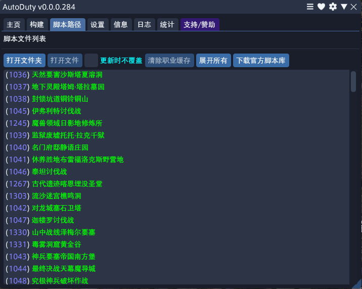
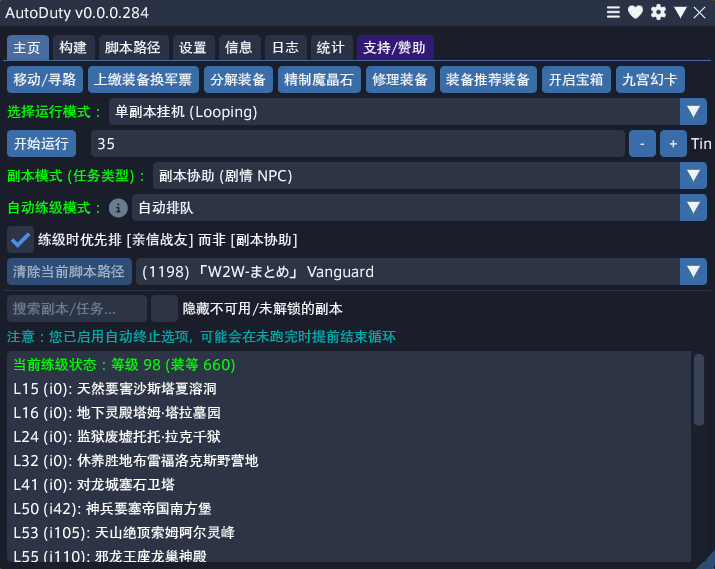

# AutoDuty (自动副本)

AutoDuty (简称 AD) 是一款适用于 FFXIV 的卫月 (Dalamud) 插件。它的主要功能是协助创建和执行副本路径，通过游戏内的**剧情辅助器 (Duty Support)**、**亲信战友 (Trusts)** 或 **冒险者分队 (Squadrons)** 系统来实现全自动的副本循环挂机。

如需支持，请前往 [Puni.sh Discord 服务器](https://discord.gg/punishxiv) 的 [此频道](https://discord.com/channels/1001823907193552978/1236757595738476725)。

_本插件代码未授权，遵循 [默认版权法](https://docs.github.com/en/repositories/managing-your-repositorys-settings-and-features/customizing-your-repository/licensing-a-repository#choosing-the-right-license)_

# 副本路径 (Dungeon Paths)

AutoDuty 支持的每一个副本都内置了预设路径，这些路径经过配置，理论上可以无故障通关。如果在运行中遇到任何问题，请务必前往 [支持 Discord](https://discord.gg/punishxiv) 反馈。

这些路径会覆盖所有的宝箱位置。如果进行了相关配置，插件会在副本运行期间，或者在设定的运行次数结束后，自动拾取并处理这些战利品。

AutoDuty 也支持玩家自定义路径，你可以通过插件顶部的 `Build` (构建) 标签页轻松完成。关于当前路径的适配状态，请参考 [支持 Discord](https://discord.gg/punishxiv) 中 [AutoDuty 频道](https://discord.com/channels/1001823907193552978/1236757595738476725) 的 [置顶在线表格](https://discord.com/channels/1001823907193552978/1236757595738476725/1243059104528994334)。

# 自动练级 (Automatic Leveling)

AutoDuty 拥有自动练级功能，它会持续带你运行“最合适”的副本来获取经验。插件通常会根据路径质量、BOSS 战的支持程度以及副本等级来决定打哪个本。

使用 AutoDuty，你可以将一个职业从 15 级快速提升至满级，并且全程完全挂机 (AFK)——前提是你准备了合适的装备，并在 AD 设置中开启了“自动穿戴最佳装备”选项。

此外，该插件也可以用同样的逻辑帮你练 **亲信战友 (Trusts)** 的等级。它可以智能选择 NPC 成员并将他们全部练到满级，全程无需人工干预。

# 自动化功能 (Automations)

AutoDuty 支持广泛的自动化流程，并能与其他插件深度集成。以下列举了 AD 在自动化副本过程中提供并没有的部分功能：

| 进本前 | 副本中 | 副本间隔 | 循环结束后 |
| -------- | -------- | -------- | -------- |
| 移动至旅馆、房屋或部队房   自动修理 (自身修理或找 NPC)   执行命令 (如 SND 脚本)   自动使用食物/药水 | 拾取宝箱   管理插件状态 | 自动精炼魔晶石   自动分解战利品   自动上交装备给大国防联军   调用 AutoRetainer (雇员)   自动穿戴最佳装备 | 达到指定等级后停止   休息经验 (蓝条) 耗尽后停止   开启 AutoRetainer 多角色模式   自动关闭电脑 |

# 安装指南 (Installation)

请将 `https://puni.sh/api/repository/erdelf` 添加到你的插件仓库列表，然后在插件安装器中搜索 `AutoDuty` 进行安装。

安装后，可以通过插件安装器界面或在聊天框输入 `/ad` 命令来打开设置。

## 核心依赖插件 (必装)

此外，AutoDuty 必须配合以下插件才能工作。请右键点击插件名称复制 URL，并将其添加到你的游戏内仓库中：

- [vnavmesh](https://puni.sh/api/repository/veyn): 提供带路点功能的自动导航系统。
- [Wrath Combo](https://github.com/PunishXIV/WrathCombo) 或 [Rotation Solver Reborn](https://raw.githubusercontent.com/FFXIV-CombatReborn/CombatRebornRepo/main/pluginmaster.json): 自动循环/战斗执行，支持全职业。
- [Veyn's Boss Mod](https://puni.sh/api/repository/veyn) 或 [BossmodReborn](https://raw.githubusercontent.com/FFXIV-CombatReborn/CombatRebornRepo/main/pluginmaster.json): 自动处理 BOSS 机制。

## 可选插件

以下插件非强制安装，但它们与 AutoDuty 集成良好，某些情况下 AD 可以自动触发它们：

- [Gearsetter](https://plugins.carvel.li): 自动扫描背包并装备更强的装备。
- [AutoRetainer](https://love.puni.sh/ment.json): 自动管理雇员、潜水艇以及派遣探险委托。
 
# 获取帮助 (Getting Help)

当你发现 Bug 或认为插件有问题时，请前往 [Puni.sh Discord 服务器](https://discord.gg/punishxiv) 的 [此频道](https://discord.com/channels/1001823907193552978/1236757595738476725) 提问。那里可能有已知的解决方案，或者有人能快速通过。此外，问题有时可能出在依赖插件上，Discord 里的用户可以帮你判断问题根源并指引你去正确的地方反馈。

**提问的最佳方式** 是不要只说“我在这个副本里死了，我不知道为什么”。请务必提供尽可能多的细节：你在哪个 BOSS 死的？是否卡在了具体的某个坐标点？

- 关于 **Veyn's Boss Mod** 和 **vnavmesh** 的支持，请前往 [Puni.sh Discord 服务器](https://discord.gg/punishxiv) 的 [此频道](https://discord.com/channels/1001823907193552978/1191076246860349450)。
- 关于 **Wrath Combo** 的支持，请前往 Puni.sh 服务器的 [此频道](https://discord.com/channels/1001823907193552978/1271175781569003590)。
- 关于 **BossModReborn** 和 **Rotation Solver Reborn** 的支持，请前往 [Combat Reborn Discord 服务器](https://discord.gg/p54TZMPnC9)。

最后，欢迎随时提交功能请求 (Feature Requests) 和 Bug 报告。